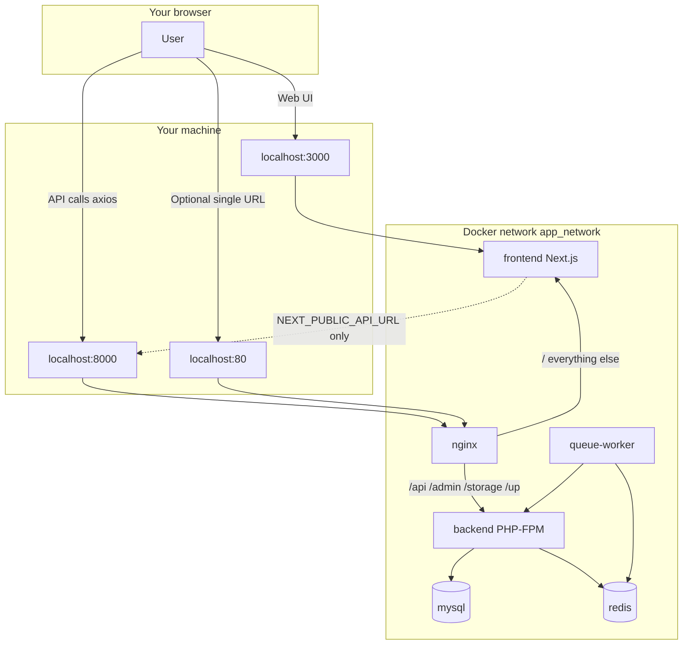

# Docker setup — guide for developers

This document explains **what was added** to the monorepo, **how the pieces fit together**, and **how to run the app** locally or in staging/production.

For day-to-day command reference (migrate, queues, troubleshooting), see [docker/README.md](docker/README.md).

---

## What was built

A full **Docker Compose** stack was added at the repository root so you can run the entire Construction Marketplace without installing PHP, Node, MySQL, or Redis on your machine.

| Component | Technology | Purpose |
|-----------|------------|---------|
| **Backend** | PHP 8.3-FPM, Laravel 11 | REST API + Filament admin at `/admin` |
| **Frontend** | Node 22 LTS, Next.js 16 | Web app on port **3000** |
| **Nginx** | Reverse proxy | API/Filament on port **8000**, unified app on port **80** |
| **MySQL 8.4** | Database | Replaces local SQLite for Docker |
| **Redis 7** | Cache, sessions, queues | Faster than database driver |
| **Queue worker** | Supervisor | Runs `php artisan queue:work` in the background |
| **Scheduler** | Shell loop | Runs `php artisan schedule:run` every minute |

### Application folders (unchanged names)

The repo still uses:

- `construction-marketplace-api/` — Laravel API (not renamed to `backend/`)
- `construction-marketplace-web/` — Next.js app (not renamed to `frontend/`)

Docker **service names** are `backend` and `frontend`; folder names on disk stay the same.

### Code changes in the apps

| File | Change |
|------|--------|
| `construction-marketplace-api/composer.json` | PHP requirement `^8.3` (matches Docker image) |
| `construction-marketplace-web/next.config.ts` | `output: "standalone"` for smaller production images |

### New files and folders

```
construction/
├── DOCKER.md                          ← this guide
├── docker-compose.yml                 ← base services (all environments)
├── docker-compose.dev.yml             ← hot reload, bind mounts
├── docker-compose.staging.yml         ← staging tweaks
├── docker-compose.prod.yml            ← production hardening
├── .env.docker.example                ← copy to .env (Compose variables)
├── .dockerignore
├── .github/workflows/docker.yml       ← CI: build images, push to GHCR
├── docker/
│   ├── README.md                      ← command cheat sheet
│   ├── backend/                       ← PHP Dockerfiles, entrypoint, php.ini
│   ├── frontend/                      ← Node Dockerfiles (prod + dev)
│   ├── nginx/                         ← reverse proxy configs + SSL template
│   ├── supervisor/                    ← queue worker processes
│   ├── scheduler/                     ← Laravel scheduler script
│   └── mysql/init/                    ← optional SQL on first DB boot
├── construction-marketplace-api/
│   ├── .env.docker.example            ← Laravel settings for Docker
│   └── .dockerignore
└── construction-marketplace-web/
    ├── .env.docker.example            ← NEXT_PUBLIC_API_URL
    └── .dockerignore
```

---

## How traffic flows



**Important:** The Next.js app calls the API using `NEXT_PUBLIC_API_URL` (default `http://localhost:8000/api`). That URL must be reachable from **your browser**, not from inside Docker. Do not set it to `http://backend:8000` — that only works container-to-container.

---

## Prerequisites

1. [Docker Desktop](https://www.docker.com/products/docker-desktop/) (Windows/macOS) or Docker Engine + Compose v2 (Linux).
2. At least **4 GB RAM** free for MySQL + Node build.
3. Ports **3000**, **8000**, **80** (and **3306** / **6379** in dev) available on your machine.

---

## First-time setup (local development)

### Step 1 — Copy environment files

From the repository root (`construction/`):

**PowerShell (Windows):**

```powershell
Copy-Item .env.docker.example .env
Copy-Item construction-marketplace-api\.env.docker.example construction-marketplace-api\.env
```

**Bash (macOS/Linux):**

```bash
cp .env.docker.example .env
cp construction-marketplace-api/.env.docker.example construction-marketplace-api/.env
```

### Step 2 — Align passwords

Use the **same** database password in both places:

| Root `.env` | API `construction-marketplace-api/.env` |
|-------------|----------------------------------------|
| `MYSQL_PASSWORD=...` | `DB_PASSWORD=...` (same value) |
| `MYSQL_DATABASE=construction` | `DB_DATABASE=construction` |
| `MYSQL_USER=construction` | `DB_USERNAME=construction` |

Set `NEXT_PUBLIC_API_URL=http://localhost:8000/api` in root `.env` (already the default in the example file).

### Step 3 — Start containers

```bash
docker compose -f docker-compose.yml -f docker-compose.dev.yml up --build
```

The first run can take **10–20 minutes** (Composer + npm install inside containers). Later starts are much faster.

### Step 4 — Generate Laravel app key

In a **new terminal** (while containers are running):

```bash
docker compose -f docker-compose.yml -f docker-compose.dev.yml exec backend php artisan key:generate
```

### Step 5 — Run migrations

```bash
docker compose -f docker-compose.yml -f docker-compose.dev.yml exec backend php artisan migrate
```

### Step 6 — Create Filament admin (optional)

```bash
docker compose -f docker-compose.yml -f docker-compose.dev.yml exec backend php artisan make:filament-user
```

### Step 7 — Open the app

| URL | What you get |
|-----|----------------|
| http://localhost:3000 | Next.js frontend (hot reload) |
| http://localhost:8000/api | Laravel API (JSON) |
| http://localhost:8000/admin | Filament dashboard |
| http://localhost:8000/up | Health check |
| http://localhost:80 | Frontend via Nginx (API routes on same host) |

---

## Development vs staging vs production

Compose uses a **base file** plus an **overlay** per environment:

| Environment | Command | Behaviour |
|-------------|---------|-----------|
| **Development** | `docker compose -f docker-compose.yml -f docker-compose.dev.yml up` | Source code mounted into containers; `next dev` + `php-fpm`; MySQL/Redis ports exposed |
| **Staging** | `docker compose -f docker-compose.yml -f docker-compose.staging.yml up -d --build` | Production-style images; `RUN_MIGRATIONS=true` by default |
| **Production** | `docker compose -f docker-compose.yml -f docker-compose.prod.yml up -d --build` | No DB/Redis on host ports; Redis password; resource limits |

**Shorthand alias (optional):** define in your shell:

```bash
# Bash
alias dc-dev='docker compose -f docker-compose.yml -f docker-compose.dev.yml'

# Then: dc-dev up -d
```

---

## What each Docker service does

### `backend`

- Runs **PHP 8.3-FPM** with extensions: MySQL, Redis, GD, ZIP, Intl, etc.
- On start, the **entrypoint** (`docker/backend/entrypoint.sh`):
  - Waits for MySQL
  - Runs `php artisan storage:link`
  - Optionally runs migrations if `RUN_MIGRATIONS=true`
  - Caches config/routes/views in staging/production

### `nginx`

- **Port 8000:** Laravel only (API, Filament, uploaded files under `/storage`).
- **Port 80:** Proxies `/` to Next.js; `/api`, `/admin`, etc. still go to Laravel.
- Production image includes a copy of `public/` (Filament assets, `index.php`).

### `frontend`

- **Dev:** `npm run dev` with file polling (works on Windows bind mounts).
- **Prod:** Multi-stage build → standalone `node server.js` (small image).

### `mysql` / `redis`

- Data stored in named volumes (`mysql_data`, `redis_data`) so data survives `docker compose down`.
- Health checks prevent Laravel from starting before the database is ready.

### `queue-worker`

- **Supervisor** runs 2 worker processes: `php artisan queue:work redis`.
- Requires `QUEUE_CONNECTION=redis` in Laravel `.env` (set in `.env.docker.example`).

### `scheduler`

- Runs `schedule:run` every 60 seconds (equivalent to a cron `* * * * *`).

---

## Everyday commands

Replace the long `-f` flags with your alias if you created one.

```bash
# Start in background
docker compose -f docker-compose.yml -f docker-compose.dev.yml up -d

# View logs
docker compose -f docker-compose.yml -f docker-compose.dev.yml logs -f backend
docker compose -f docker-compose.yml -f docker-compose.dev.yml logs -f frontend

# Stop
docker compose -f docker-compose.yml -f docker-compose.dev.yml down

# Stop and delete database (destructive)
docker compose -f docker-compose.yml -f docker-compose.dev.yml down -v

# Shell into backend
docker compose -f docker-compose.yml -f docker-compose.dev.yml exec backend sh

# Run any Artisan command
docker compose -f docker-compose.yml -f docker-compose.dev.yml exec backend php artisan migrate:status

# Restart queue workers after code change
docker compose -f docker-compose.yml -f docker-compose.dev.yml exec backend php artisan queue:restart
```

---

## How the frontend talks to the API

In `construction-marketplace-web/src/services/api.ts`:

```ts
const API_URL = process.env.NEXT_PUBLIC_API_URL || 'http://localhost:8000/api';
```

- Set **`NEXT_PUBLIC_API_URL`** in root `.env` for Docker Compose (passed to the frontend container).
- In production builds, the same value is baked in at **image build time** (see `docker/frontend/Dockerfile` build arg).
- **Sanctum / cookies:** `SANCTUM_STATEFUL_DOMAINS` in the API `.env` includes `localhost:3000` and `localhost:8000`.

---

## Uploads and storage

- User uploads live in `storage/app/` (volume `backend_storage` in production).
- `php artisan storage:link` creates `public/storage` → `storage/app/public`.
- Nginx serves files under **http://localhost:8000/storage/...**

---

## CI/CD (GitHub Actions)

Workflow file: [`.github/workflows/docker.yml`](.github/workflows/docker.yml)

On push to `main` / `develop`:

1. Builds backend, queue-worker, frontend, and nginx images.
2. Pushes to GitHub Container Registry (`ghcr.io`).
3. Runs Trivy security scan on the backend image.

Set repository variable **`NEXT_PUBLIC_API_URL`** in GitHub for correct production frontend builds.

---

## Production deployment (summary)

1. Copy `.env.docker.example` → `.env` on the server; set strong passwords and real domains.
2. Copy API `.env.docker.example` → `construction-marketplace-api/.env`; set `APP_ENV=production`, `APP_DEBUG=false`.
3. Set `NEXT_PUBLIC_API_URL` to your public API URL (e.g. `https://api.yourdomain.com/api`).
4. Build and start:

   ```bash
   docker compose -f docker-compose.yml -f docker-compose.prod.yml up -d --build
   ```

5. Run migrations (if not using `RUN_MIGRATIONS=true`):

   ```bash
   docker compose -f docker-compose.yml -f docker-compose.prod.yml exec backend php artisan migrate --force
   ```

6. After deploy: `php artisan queue:restart` and `php artisan optimize`.

**SSL:** Place certificates in `docker/nginx/certs/` and uncomment blocks in `docker/nginx/conf.d/ssl.conf`. See [docker/README.md](docker/README.md).

---

## Troubleshooting

| Problem | Solution |
|---------|----------|
| Port already in use | Change `FRONTEND_PORT`, `NGINX_API_PORT`, or `NGINX_HTTP_PORT` in root `.env`. |
| `Access denied for user` (MySQL) | Match `MYSQL_*` in root `.env` with `DB_*` in API `.env`. |
| Blank page / 502 on :8000 | Check `docker compose ps`; wait for `backend` to be healthy. |
| Frontend cannot reach API | Use `http://localhost:8000/api`, not `http://backend/...`. |
| Changes not reflected (Windows) | Dev compose sets `WATCHPACK_POLLING=true`; restart frontend container. |
| `vendor` missing | Dev backend runs `composer install` on start; or run it manually via `exec backend composer install`. |
| Backend image build fails on `gd` / `composer` | Rebuild after pulling latest `docker/backend/Dockerfile` (PHP 8.3 GD flags + Composer runs on PHP image with extensions). |


---

## Further reading

- [docker/README.md](docker/README.md) — operational cheat sheet, security notes, volume backup
- [docker/nginx/conf.d/ssl.conf](docker/nginx/conf.d/ssl.conf) — HTTPS configuration template
- [construction-marketplace-api/README.md](construction-marketplace-api/README.md) — API documentation
